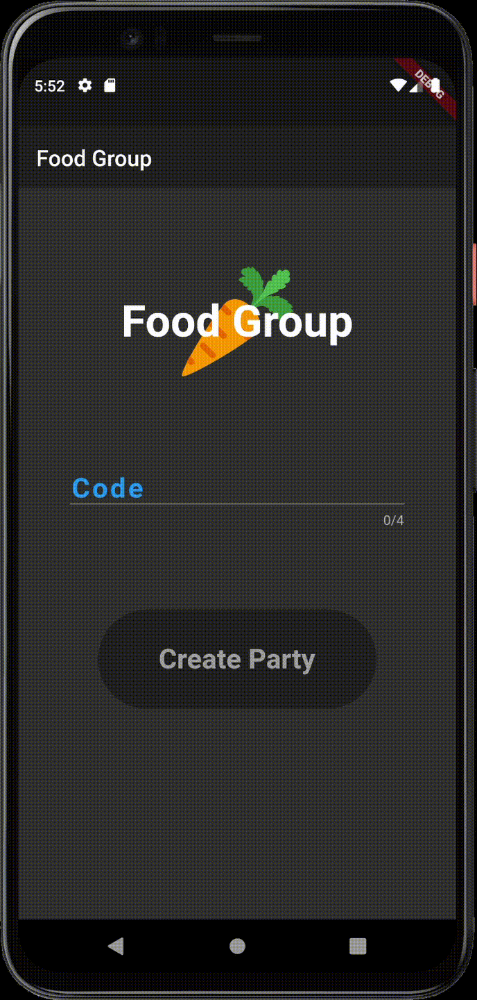

# Food Groups 🥕
An app to help friends decide where to eat.

Users can either create or join sessions.

  
  

The makes sure to check for errors.

Currently, the app can initiate sessions through a shared code using Firebase. In the future, the app should pull from Google Places API to find nearby restaurants, and store user preferences in the Firebase database (there is still a bit of work to do...) 🙂

Feel free to use what I made to integrate "sessions" into your own projects!
